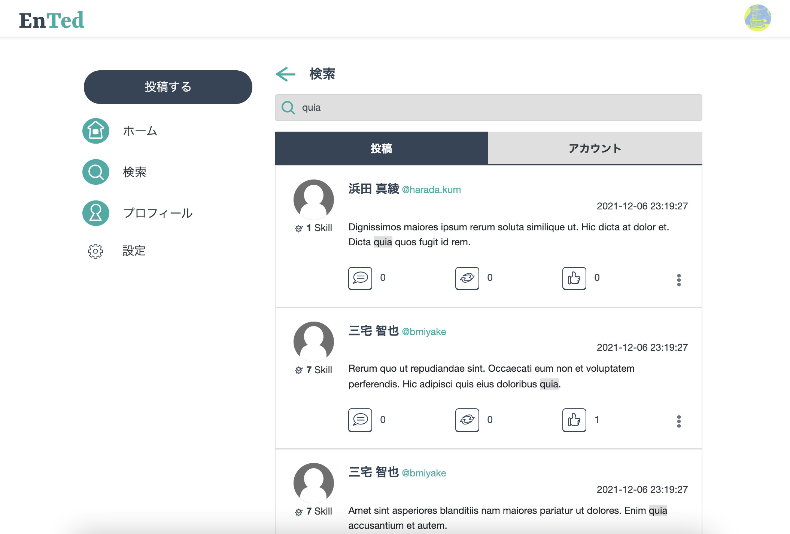
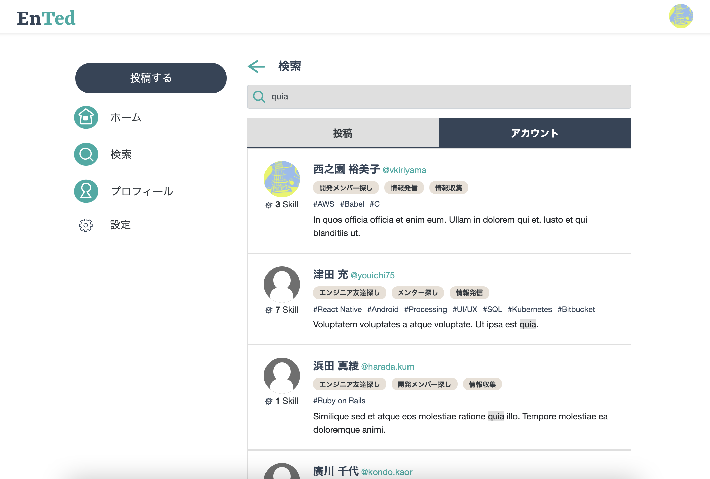
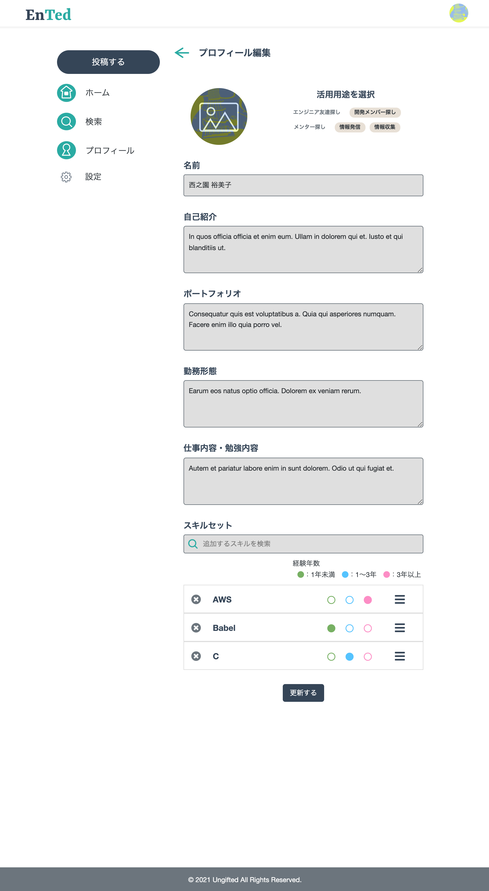
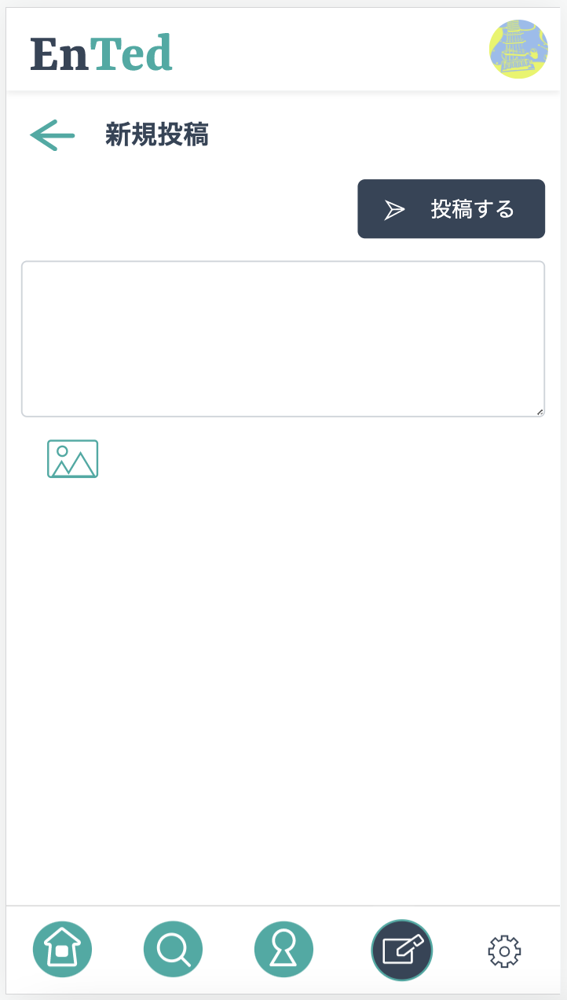
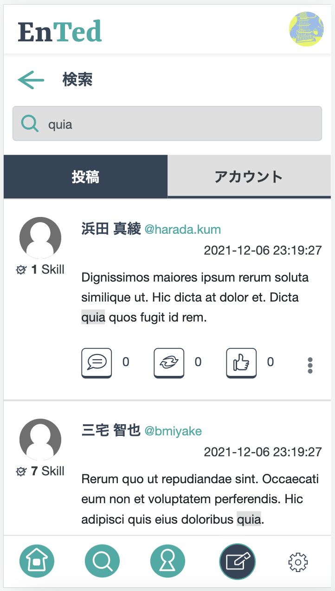
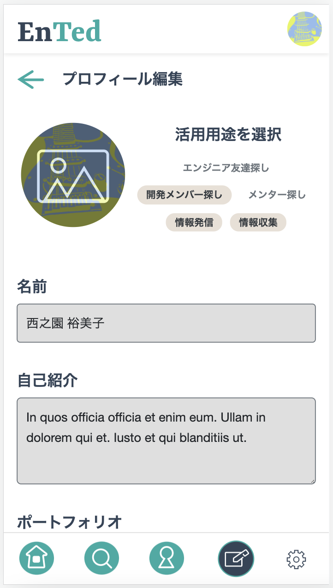

# エンジニア向けSNS「Ented」の画面サンプル(開発中)
- いくつかの画面をサンプルとして抜粋しています
## PC版
### ホーム画面

### 新規投稿画面

### 投稿検索画面

### ユーザー検索画面

### プロフィール画面

### プロフィール編集画面

## SP版
### ホーム画面

### 新規投稿画面

### 投稿検索画面

### ユーザー検索画面

### プロフィール画面(1)

### プロフィール画面(2)

### プロフィール編集画面(1)

### プロフィール編集画面(2)

